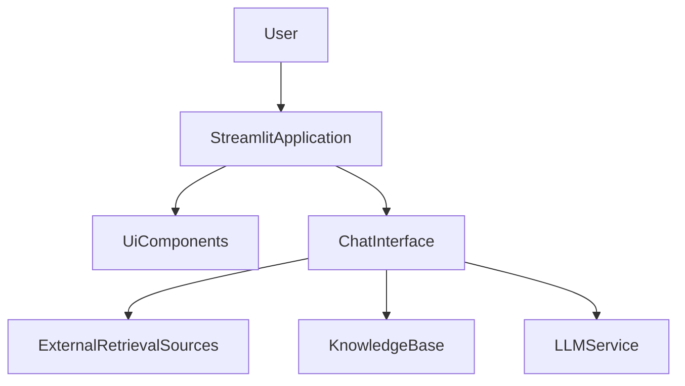

# llm-knowledge-system — Repository Overview

### High-Level Purpose
The primary objective of this system is to provide an interactive Hybrid Retrieval Augmented Generation (RAG) search engine. It enables users to query a knowledge base, which can be dynamically augmented with uploaded documents, web search results, and Wikipedia content, to generate comprehensive answers.

### Architectural Structure
The system employs a layered architecture, separating presentation, application control, and core RAG logic.
*   **Presentation Layer**: Built with Streamlit, it provides the interactive user interface and leverages a modular `ui` package for reusable UI components.
*   **Application Control Layer**: The `app.py` script serves as the main orchestrator, managing user interactions, application state via `st.session_state`, and coordinating calls to the RAG processing layer.
*   **Core RAG Logic Layer**: Encapsulated within the `ChatInterface`, this layer handles data retrieval, processing, and generation, interfacing with various data sources and LLM services.
*   **Entry Point**: `main.py` functions as the top-level execution point, though currently contains minimal logic.

### Core Components
*   **Streamlit Application (`app.py`)**: The central controller for the user interface, responsible for rendering UI elements, managing session state, and processing user input.
*   **`ChatInterface`**: A core component responsible for the entire RAG workflow, including answering user questions, processing uploaded documents, and integrating with external knowledge sources like web search and Wikipedia.
*   **UI Components (`ui.components`)**: A collection of modular utility functions within the `ui` package, used by `app.py` to render specific parts of the Streamlit interface, ensuring reusability.
*   **`main.py`**: The application's initial execution point.

### Interaction & Data Flow
User interaction initiates within the Streamlit application, driven by `app.py`.
1.  **User Input**: Users submit questions via `st.chat_input` or upload documents (PDF, TXT, MD) through a file uploader.
2.  **Application Control**: `app.py` captures user input, updates `st.session_state` (e.g., chat history, feature toggles), and delegates processing to the `ChatInterface` instance.
3.  **RAG Processing**:
    *   For questions, `ChatInterface.answer()` retrieves information from configured sources (user documents, web search, Wikipedia) and utilizes an LLM to generate a response.
    *   For document uploads, `ChatInterface.process_documents()` integrates the new content into the system's knowledge base.
4.  **Response Display**: Processed answers and source citations from `ChatInterface` are returned to `app.py`, which then updates and displays them within the Streamlit chat history.
5.  **State Management**: `st.session_state` is continuously used to maintain conversational context, `ChatInterface` instance, and feature toggle states across Streamlit reruns.

### Technology Stack
*   **Python**: The core programming language for the entire system.
*   **Streamlit**: The primary framework for developing the interactive web application user interface.
*   **LLM Services & Vector Stores**: Implied foundational components for the RAG architecture, abstracted by the `ChatInterface`.

### Design Observations
*   **Modular Architecture**: Clear separation between UI, application control, and RAG logic enhances maintainability and scalability.
*   **Effective State Management**: Extensive use of Streamlit's `st.session_state` ensures a continuous chat experience and persistent application settings.
*   **Dynamic Configuration**: User interface toggles provide direct control over RAG behavior, such as enabling/disabling web search or Wikipedia integration.
*   **Interactive Knowledge Base**: The ability for users to upload and process custom documents directly via the UI offers a flexible method for extending the system's knowledge domain.
*   **Minimal Entry Point**: `main.py` currently serves as a basic entry point, indicating potential for future expansion.

### System Diagram
