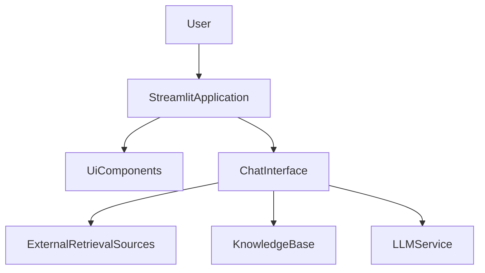

# llm-knowledge-system — Repository Overview

### High-Level Purpose
The primary objective of this system is to provide a user-friendly, interactive Hybrid Retrieval Augmented Generation (RAG) search engine. It enables users to query a knowledge base, which can be augmented dynamically with uploaded documents, web search results, and Wikipedia content, to generate comprehensive answers.

### Architectural Structure
The system follows a layered architecture, with a clear separation between the presentation layer, application control, and core RAG logic.

*   **Presentation Layer**: Implemented using Streamlit, providing the interactive user interface. This layer includes reusable UI components for displaying chat history, input fields, and configuration toggles.
*   **Application Control Layer**: The `app.py` script acts as the main orchestrator, handling user interactions, managing application state, and coordinating calls to the core RAG processing logic.
*   **Core RAG Logic Layer**: Encapsulated within the `ChatInterface`, this layer is responsible for the retrieval, processing, and generation aspects of the RAG system, interacting with various data sources and LLM services.

The system's modular design, particularly within the `ui` package, separates UI elements from business logic.

### Core Components
*   **Streamlit Application (`app.py`)**: The main entry point and controller for the user interface, responsible for rendering UI elements, managing session state, and handling user input.
*   **ChatInterface (`ui.chat_interface.ChatInterface`)**: The central component for the RAG system. It handles core functionalities such as answering user questions, processing uploaded documents, and integrating with external knowledge sources (web, Wikipedia).
*   **UI Components (`ui.components`)**: A collection of modular utility functions for rendering specific parts of the Streamlit interface, promoting code reusability and simplifying UI development.

### Interaction & Data Flow
User interaction begins with the Streamlit application. Users can submit questions or upload documents (PDF, TXT, MD).
1.  **User Input**: A user enters a query via the `st.chat_input` or uploads documents via the file uploader.
2.  **Application Control**: `app.py` receives the input, updates the session state, and delegates processing to the `ChatInterface` instance.
3.  **RAG Processing**:
    *   For questions, `ChatInterface.answer()` is called, which internally retrieves information from potentially three sources: processed user documents, web search, and Wikipedia (based on UI toggles). This information is then used to generate an answer via an LLM.
    *   For document uploads, `ChatInterface.process_documents()` is called to integrate the new content into the system's knowledge base.
4.  **Response Display**: The answer or processing feedback from `ChatInterface` is returned to `app.py`, which then displays it in the Streamlit chat history, often with expandable source citations.
5.  **State Management**: `st.session_state` is crucial for maintaining conversational context, `ChatInterface` instance, and feature toggle states across Streamlit reruns.

### Technology Stack
*   **Streamlit**: Primary framework for building the interactive web application user interface.
*   **Python**: The core programming language for the entire system.
*   **LLM Providers & Vector Stores**: Implied by the RAG architecture and `ChatInterface` functionality, though specific implementations are abstracted away in the provided file summary.

### Design Observations
*   **Modular Architecture**: Clear separation of UI, application control, and core RAG logic enhances maintainability and scalability.
*   **Session State Management**: Effective use of Streamlit's `st.session_state` ensures continuity of the chat experience and application settings.
*   **Dynamic Configuration**: Integration of UI toggles allows users to dynamically control RAG behavior, such as enabling/disabling web search or Wikipedia inclusion.
*   **Interactive Knowledge Base**: The ability to upload and process custom documents directly through the UI provides a flexible mechanism for users to expand the system's knowledge scope.

### System Diagram
