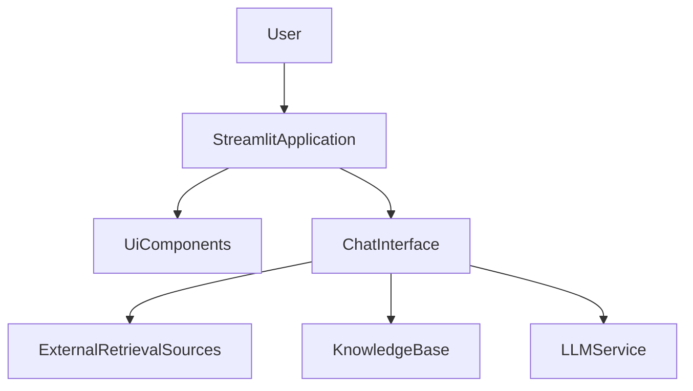

# llm-knowledge-system — Repository Overview

### High-Level Purpose
The primary objective of this system is to provide an interactive Hybrid Retrieval Augmented Generation (RAG) search engine. It enables users to query a knowledge base, dynamically augmented with uploaded documents, web search results, and Wikipedia content, to generate comprehensive answers.

### Architectural Structure
The system employs a layered architecture. The presentation layer, built with Streamlit, provides the interactive user interface, leveraging a modular `ui` package. The `app.py` script acts as the application control layer, managing user interactions and state. Core RAG logic is encapsulated within the `ChatInterface`, handling data retrieval, processing, and generation. `main.py` serves as the top-level execution point.

### Core Components
*   **Streamlit Application (`app.py`)**: Central controller for the user interface, managing UI rendering, session state, and processing user input.
*   **`ChatInterface`**: Handles the RAG workflow, including answering user questions, processing uploaded documents, and integrating with external knowledge sources.
*   **UI Components (`ui.components`)**: Modular utility functions for rendering specific Streamlit interface parts, promoting reusability.
*   **`main.py`**: The application's initial execution point.

### Interaction & Data Flow
User interaction begins in the Streamlit application via `app.py`. User input (questions or document uploads) is captured by `app.py`, which updates `st.session_state` and delegates processing to the `ChatInterface`. The `ChatInterface` retrieves information from configured sources and uses an LLM to generate responses or processes new documents. Answers and source citations are then returned to `app.py` for display within the chat history. `st.session_state` maintains conversational context and application settings across reruns.

### Technology Stack
*   **Python**: Core programming language.
*   **Streamlit**: Framework for the interactive web application user interface.
*   **LLM Services & Vector Stores**: Implied foundational components for RAG architecture, abstracted by `ChatInterface`.

### Design Observations
*   **Modular Architecture**: Clear separation of UI, application control, and RAG logic enhances maintainability and scalability.
*   **Effective State Management**: Extensive use of Streamlit's `st.session_state` ensures a continuous chat experience and persistent application settings.
*   **Dynamic Configuration**: UI toggles allow users to control RAG behavior, such as enabling/disabling web search or Wikipedia integration.
*   **Interactive Knowledge Base**: Users can upload and process custom documents directly via the UI, providing a flexible method to extend the system's knowledge domain.
*   **Minimal Entry Point**: `main.py` is currently a basic entry point, indicating potential for future expansion of application startup logic.

### System Diagram
