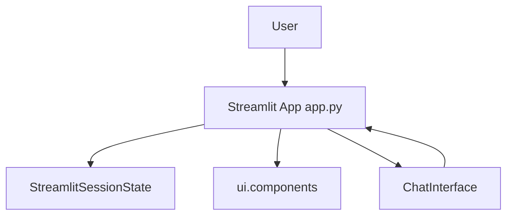

# app.py

> **Source File:** [app.py](https://github.com/code-wenture/llm-knowledge-system/blob/main/app.py)
> **Repository:** `llm-knowledge-system`
> **Branch:** `main`

# app.py

### Overview
This file serves as the main entry point for the Hybrid RAG Search Engine Streamlit application. It sets up the user interface, manages session state, orchestrates user interactions, and integrates with the core RAG logic.

### Architecture & Role
Architecturally, `app.py` operates as the presentation layer and primary application controller for the Streamlit frontend. It is responsible for rendering all UI elements and handling user input, acting as the orchestrator between the user and the backend RAG processing logic encapsulated in `ChatInterface`.

### Key Components
*   **`main()` function**: The application's main execution function, responsible for initializing the Streamlit page, managing session state, rendering UI components, and processing user inputs.
*   **`st.session_state`**: Streamlit's built-in mechanism used to maintain state across reruns, storing the `ChatInterface` instance, `web_enabled`, and `include_wikipedia` flags.
*   **`ChatInterface`**: An instance of this class (from `ui.chat_interface`) is stored in `st.session_state` and handles the core RAG logic, including answering questions and processing documents.
*   **UI Components (from `ui.components`)**:
    *   `init_session_state()`: Initializes default values in `st.session_state`.
    *   `display_sidebar()`: Renders the application's sidebar.
    *   `display_chat_history()`: Displays previous messages in the chat interface.
    *   `add_message()`: Utility to add messages to the chat history stored in session state.

### Execution Flow / Behavior
1.  The `main()` function is called upon script execution (`if __name__ == "__main__":`).
2.  Streamlit page configuration is set, and `st.session_state` is initialized by `init_session_state()`.
3.  A `ChatInterface` instance is created and stored in `st.session_state` if not already present.
4.  The sidebar, application title, and chat history are displayed.
5.  The application continuously monitors `st.chat_input` for user questions.
    *   If a prompt is entered, the user's message is added to history and displayed.
    *   `chat.answer()` is invoked with the prompt and current toggle states (`web_enabled`, `include_wikipedia`).
    *   The assistant's answer and sources are added to history and displayed, with sources presented in an expandable section.
6.  Toggles for "Enable Web Search" and "Enable Wikipedia" are rendered, dynamically updating `st.session_state` values.
7.  A document upload section allows users to upload PDF, TXT, or MD files.
    *   If files are uploaded and the "Process Documents" button is clicked, `chat.process_documents()` is called.
    *   A success message is shown, and the application reruns to update the state, typically reflecting the new vector store status.

### Dependencies
*   **`streamlit`**: The primary external dependency, providing the framework for building the web application's user interface and managing its state.
*   **`ui.chat_interface.ChatInterface`**: An internal dependency providing the core business logic for the RAG system, abstracting away the complexities of document processing and answering queries.
*   **`ui.components`**: An internal dependency providing modular UI functions that encapsulate specific display logic, promoting code reusability and organization.

### Design Notes
*   The application leverages Streamlit's `st.session_state` extensively for managing persistent data like the chat interface instance, chat history, and feature toggles, crucial for maintaining state across reruns.
*   UI logic is separated into `ui.components` for modularity, and core RAG logic is delegated to the `ChatInterface`, promoting a cleaner architecture and easier maintenance.
*   Feature toggles for web search and Wikipedia integration provide dynamic control over the RAG system's behavior directly from the UI.
*   The document upload and processing mechanism is integrated directly into the UI, allowing users to interactively update the RAG's knowledge base.

### Diagram
