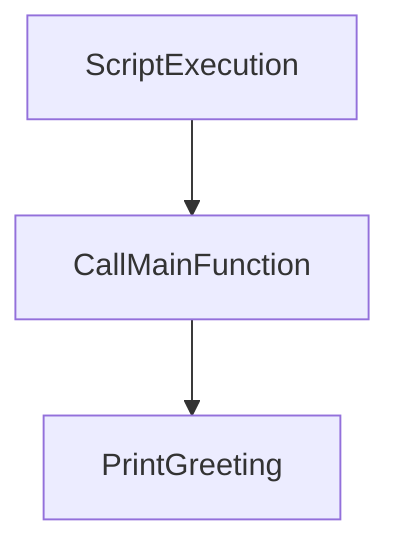

# main.py

> **Source File:** [main.py](https://github.com/code-wenture/llm-knowledge-system/blob/main/main.py)
> **Repository:** `llm-knowledge-system`
> **Branch:** `main`

# main.py

### Overview
This file defines and executes the primary entry point function for the `llm-knowledge-system`. It currently performs a basic output operation.

### Architecture & Role
This file serves as the top-level execution control and the application's starting point. It functions as the root module when the application is run directly.

### Key Components
- `main()`: The principal function executed when the script runs, responsible for the core logic, which currently involves printing a greeting message.

### Execution Flow / Behavior
When `main.py` is executed as the main script, the `if __name__ == "__main__":` block triggers the invocation of the `main()` function. The `main()` function then prints the string "Hello from llm-knowledge-system!" to the standard output.

### Dependencies
None significant.

### Design Notes
This file currently represents a minimal viable script, often used as a template or placeholder. Its simplicity indicates a foundational stage in application development, awaiting further expansion of core logic within the `main` function.

### Diagram
